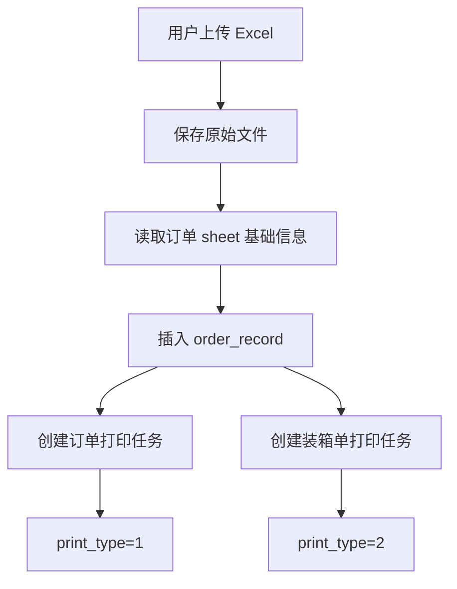
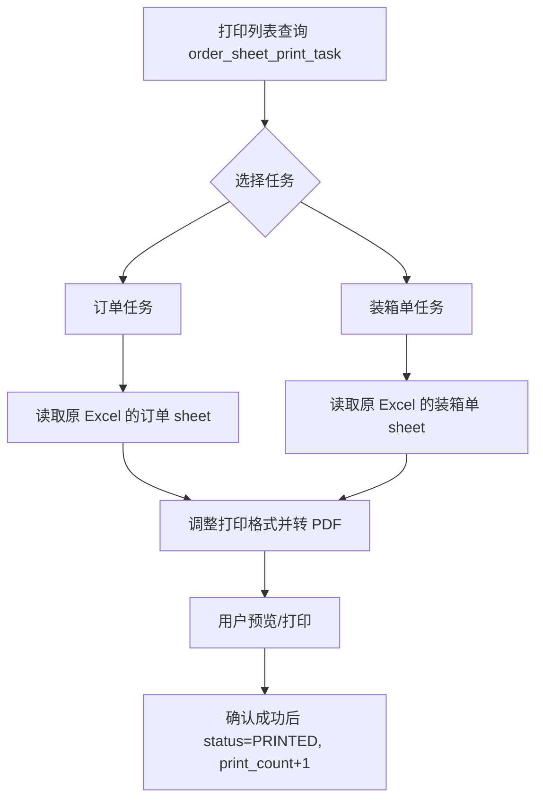
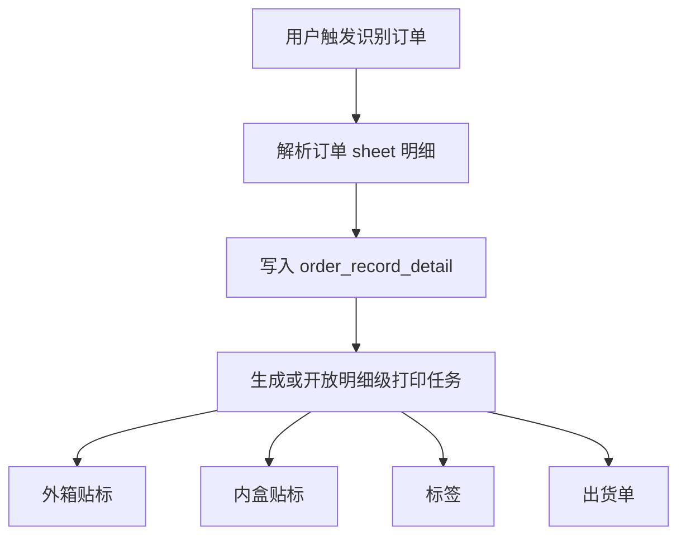
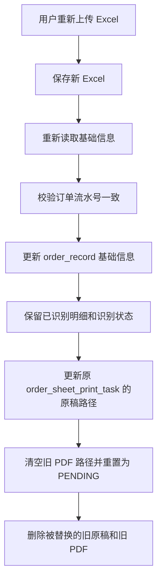

# 打印任务与识别流程设计

更新时间：2026-05-26

本文档说明当前订单 Excel 上传、基础识别、订单/装箱单打印，以及后续外箱贴标、内盒贴标、出货单等明细级打印的推荐设计。

## 1. 当前业务事实

当前用户上传的是一个 Excel 文件，文件里通常包含：

- `订单` sheet
- `装箱单` sheet
- `外箱贴标` sheet，部分文件存在
- `包装要求` sheet，部分文件存在

上传 Excel 后，系统不是马上完整识别所有明细，而是先读取基础信息并写入 `order_record`：

- 订单流水号：`order_no`
- 客户：`customer_name`
- 开发编号汇总：`development_nos`
- 总双数：`total_quantity`
- 总箱数：`total_carton_count`
- 来源类型：`source_type = EXCEL`
- 订单识别状态、装箱单识别状态默认待识别

原始文件名和本地路径写入 `order_sheet_print_task.original_file_name`、`order_sheet_print_task.original_file_path`。订单任务和装箱单任务各自保留一份原稿来源，后续重新上传时复用原任务记录，只替换原稿文件并重置打印状态。

订单单和装箱单打印不依赖完整识别。用户上传后可以直接打印，因为当前打印方式是读取原始 Excel 的指定 sheet，调整页面格式后转成 PDF。

完整识别是另一条流程：

- 识别 `订单` sheet 后写入 `order_record_detail`
- 识别 `装箱单` sheet 后写入 `order_packing_detail`
- 外箱贴标、内盒贴标、标签、出货单等后续打印依赖结构化明细数据

## 2. 打印目标分层

打印任务分成两类。

订单级打印：

- 订单 sheet 打印
- 装箱单 sheet 打印
- 关联 `order_record.id`
- 不要求完整识别
- 使用 `order_sheet_print_task`

明细级打印：

- 外箱贴标
- 内盒贴标
- 标签/吊牌
- 出货单明细打印
- 关联 `order_record_detail.id`
- 要求订单完整识别后才可生成
- 后续按业务单独建表，不放进 `order_sheet_print_task`

核心原则：

```text
order_record 管订单主信息和识别状态
order_record_detail 管订单 sheet 的每一行明细
order_sheet_print_task 管原稿路径以及订单、装箱单两个整单级 sheet 打印项
```

## 3. 已落地表

当前阶段已经新增一张表：`order_sheet_print_task`。

这张表只表示订单 Excel 里的整单级 sheet 打印任务，也就是订单和装箱单。它负责承接原来放在 `order_record` 上的订单/装箱单打印状态、PDF 路径、打印次数等字段。

外箱贴标、内盒贴标、标签、出货单等后续明细级打印，不放进这张表；到实现对应业务时再单独建表。

```sql
CREATE TABLE IF NOT EXISTS `order_sheet_print_task` (
  `id` bigint NOT NULL AUTO_INCREMENT COMMENT '主键',

  `order_id` bigint NOT NULL COMMENT '订单主表ID',

  `print_type` tinyint NOT NULL COMMENT '打印类型: 1订单 2装箱单',
  `original_file_name` varchar(255) DEFAULT NULL COMMENT '原始订单文件名',
  `original_file_path` varchar(512) DEFAULT NULL COMMENT '原始订单文件本地路径',

  `status` tinyint NOT NULL DEFAULT 1 COMMENT '状态: 1待打印 2已打印 3失败 4已失效',
  `preview_pdf_path` varchar(512) DEFAULT NULL COMMENT 'PDF预览文件路径',
  `pdf_generated_at` datetime DEFAULT NULL COMMENT 'PDF生成时间',

  `print_count` int NOT NULL DEFAULT 0 COMMENT '累计成功打印次数',
  `last_print_time` datetime DEFAULT NULL COMMENT '最后打印时间',
  `last_print_user` varchar(64) DEFAULT NULL COMMENT '最后打印人',
  `error_message` varchar(1024) DEFAULT NULL COMMENT '失败原因',

  `created_at` datetime NOT NULL DEFAULT CURRENT_TIMESTAMP COMMENT '创建时间',
  `updated_at` datetime NOT NULL DEFAULT CURRENT_TIMESTAMP ON UPDATE CURRENT_TIMESTAMP COMMENT '更新时间',

  PRIMARY KEY (`id`),
  KEY `idx_sheet_print_task_order_id` (`order_id`),
  KEY `idx_sheet_print_task_type_status` (`print_type`, `status`)
) ENGINE=InnoDB DEFAULT CHARSET=utf8mb4 COLLATE=utf8mb4_unicode_ci COMMENT='订单Sheet打印任务表';
```

不建议在 `order_sheet_print_task` 冗余 `print_scope`、sheet 名、开发编号、箱号范围等字段：

- 源文件名和路径放在任务表，方便重新上传后直接替换当前任务使用的原稿。
- 订单/装箱单 sheet 名可以通过 `PrintType` 得到。
- 开发编号、箱号范围属于明细展示信息，这张表不负责。

## 4. 打印类型枚举

数据库里 `print_type` 使用数字，后端用枚举固定含义。不要使用 Java enum 的 ordinal。

```java
public enum PrintType {
    ORDER(1, "订单", "订单"),
    PACKING(2, "装箱单", "装箱单");

    private final int code;
    private final String label;
    private final String sheetName;

    PrintType(int code, String label, String sheetName) {
        this.code = code;
        this.label = label;
        this.sheetName = sheetName;
    }

    public static PrintType fromCode(Integer code) {
        if (code == null) {
            throw new IllegalArgumentException("Print type is required");
        }
        for (PrintType type : values()) {
            if (type.code == code) {
                return type;
            }
        }
        throw new IllegalArgumentException("Unsupported print type: " + code);
    }
}
```

## 5. 打印状态枚举

当前只需要四个状态：

```text
1 PENDING  待打印
2 PRINTED  已打印
3 FAILED   失败
4 INVALID  已失效
```

状态含义：

- `PENDING`：还没有成功打印过，`print_count = 0`
- `PRINTED`：至少成功打印过一次，重新打印后仍然是这个状态，只增加打印次数
- `FAILED`：最近一次生成 PDF 或打印失败，失败原因写入 `error_message`
- `INVALID`：打印任务被人工或系统废弃后不再参与打印列表

后端枚举建议：

```java
public enum PrintTaskStatus {
    PENDING(1, "待打印"),
    PRINTED(2, "已打印"),
    FAILED(3, "失败"),
    INVALID(4, "已失效");

    private final int code;
    private final String label;

    PrintTaskStatus(int code, String label) {
        this.code = code;
        this.label = label;
    }

    public static PrintTaskStatus fromCode(Integer code) {
        if (code == null) {
            return PENDING;
        }
        for (PrintTaskStatus status : values()) {
            if (status.code == code) {
                return status;
            }
        }
        throw new IllegalArgumentException("Unsupported print task status: " + code);
    }
}
```

## 6. 上传流程

上传 Excel 时创建订单主记录，并创建两个订单级打印任务。



上传后立刻可打印：



## 7. 完整识别流程

完整识别不影响订单 sheet 和装箱单 sheet 的原始打印。



明细级打印后续单独设计，例如外箱贴标、内盒贴标、出货单各自维护自己的打印记录。

```text
order_id = 当前订单ID
order_detail_id = 当前订单明细ID
status = 业务自己的状态
```

如果后续出货单一次选择多条明细，不建议把多个明细 ID 拼字符串放进一个字段。到那一步在出货单打印自己的表里新增关系表：

```text
shipping_note_print_detail
- id
- print_task_id
- order_detail_id
```

当前阶段可以先按单条明细打印任务实现。

## 8. 重新上传流程

用户重新上传 Excel 时，复用当前订单已有的订单/装箱单打印任务，不重新创建打印任务。

推荐流程：



复用打印任务的好处：

- 打印任务 ID 不变，前端不会出现同一订单被重新生成一组打印任务。
- 新文件替换旧文件，打印和识别都读取新原稿。
- 打印次数、旧 PDF、失败原因等状态重置，避免旧文件状态混到新文件上。
- 订单 ID 不变，已识别明细、装箱明细和工序明细继续保留；如果新原稿里的明细内容确实变化，再手动重新识别覆盖旧明细。

重新上传只替换原稿和整单打印任务文件引用，不主动清理明细级业务表。

## 9. 从 order_record 移出的字段

新增 `order_sheet_print_task` 后，下面这些字段不再适合放在 `order_record`：

```sql
order_printed
packing_printed
order_pdf_path
packing_pdf_path
order_pdf_generated_at
packing_pdf_generated_at
original_file_name
original_file_path
```

对应迁移关系：

```text
order_printed
-> order_sheet_print_task.print_type = 1 的 status / print_count

packing_printed
-> order_sheet_print_task.print_type = 2 的 status / print_count

order_pdf_path
-> order_sheet_print_task.print_type = 1 的 preview_pdf_path

packing_pdf_path
-> order_sheet_print_task.print_type = 2 的 preview_pdf_path

order_pdf_generated_at
-> order_sheet_print_task.print_type = 1 的 pdf_generated_at

packing_pdf_generated_at
-> order_sheet_print_task.print_type = 2 的 pdf_generated_at

original_file_name / original_file_path
-> order_sheet_print_task 每条订单、装箱单任务各保存一份
```

实际落地状态：

1. 已新增 `order_sheet_print_task`，代码已改成读写新表。
2. 历史库如仍保留 `order_record` 上的旧打印字段，可先用 `sql/add_order_sheet_print_task.sql` 迁移。
3. 已有 `order_sheet_print_task` 但原稿字段仍在 `order_record` 的库，执行 `sql/move_original_file_to_sheet_print_task.sql`。
4. 确认历史数据迁移完成后，再删除 `order_record` 上的旧打印字段和原稿字段。

## 10. 页面查询建议

订单/装箱单打印页：

```sql
SELECT *
FROM order_sheet_print_task
WHERE status <> 4
ORDER BY created_at DESC;
```

外箱贴标/内盒贴标/标签页后续单独设计，不查 `order_sheet_print_task`。

## 11. 当前落地进度

已完成：

1. 新增 `order_sheet_print_task` 表。
2. 新增 `PrintType` 数字枚举。
3. 新增 `PrintTaskStatus` 数字枚举。
4. 上传 Excel 后自动创建订单、装箱单两个打印任务。
5. 打印列表改查 `order_sheet_print_task`。
6. PDF 路径、生成时间、打印次数写入 `order_sheet_print_task`。
7. PDF 生成失败时写入 `FAILED` 和 `error_message`，重新生成成功后清理失败原因。

后续：

1. 完整识别订单后，明细级打印另起表设计。
2. 稳定后清理历史库里 `order_record` 的旧打印字段。
